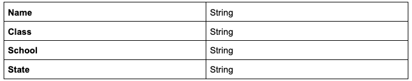
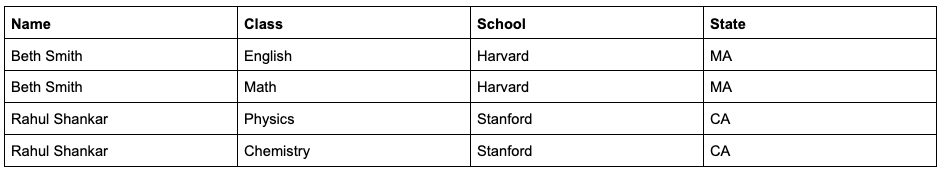

# CSV Uploader Tool

This CSV Uploader Tool is designed to map CSV file uploads to a specified database structure, allowing for dynamic adjustment to different CSV headers and database schemas. The application is built with Django and React, uses SQLite for the database, and can be easily set up and run using Docker.

For example, let’s say the input data is:


(This is just an example CSV, the input data could have different headers)

The database structure is



Example result from a mapping:



## Features

- **CSV Upload**: Users can upload CSV files with varying headers.
- **Dynamic Mapping Interface**: A simple UI allows users to map CSV columns to database fields.
- **Data Storage**: Mapped data is stored in an SQLite database.
- **Docker Integration**: The entire application can be run using Docker, ensuring consistency across different environments.

## Getting Started

These instructions will get you a copy of the project up and running on your local machine for development and testing purposes.

### Prerequisites

Ensure you have Docker installed on your machine. If not, you can install Docker by following the instructions on the [official Docker website](https://docs.docker.com/get-docker/).

### Installation

**Clone the repository**

```bash
git clone https://github.com/yourusername/csv-uploader-tool.git
cd csv-uploader-tool
```
**Start Backend Server**

```bash
cd server/csv_mapper
python3 manage.py runserver 
```
**Start Webapp**

```bash
cd frontend
npm start
```

After running this command, the application should be accessible at http://localhost:3030
